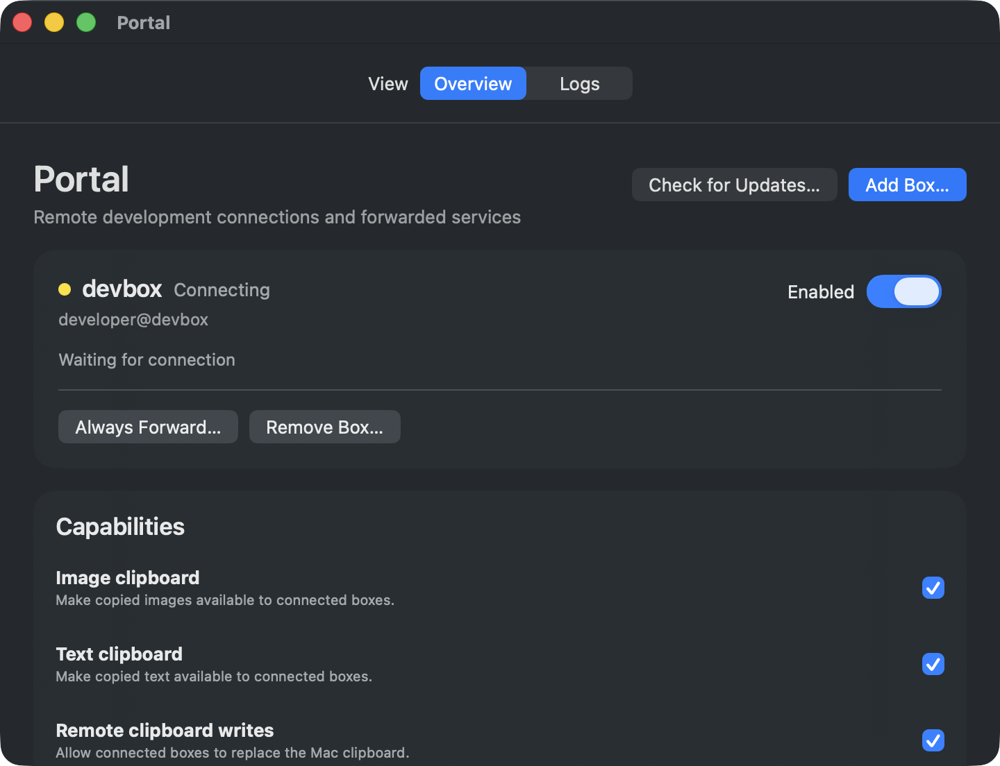
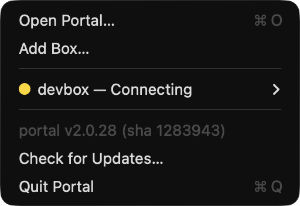

# portal

[](https://github.com/VikashLoomba/Portal/actions/workflows/ci.yml)

Dynamic SSH port forwarding from your remote Linux dev boxes to your Mac — plus
transparent **clipboard paste** (images *and* text), **notification relay**, and
**credential sharing** for coding agents running on those boxes, over a single
SSH connection portal maintains for you.

Copy a screenshot or some text on your Mac, `ssh` to your dev box, and press
`Ctrl+V` inside Claude Code / opencode — the paste "just works." When the agent
finishes or needs your approval, a native macOS notification pops on your Mac.
When it needs a password, a native dialog (or Touch ID) releases the secret
straight into the process that needs it, never into the transcript. No special
`ssh` wrapper, no reverse tunnel, no second daemon of your own.

portal runs as a background daemon with a menu bar status item, connects to
**several boxes at once**, and gives each one a stable, collision-free block of
localhost ports.

## Installation

### Recommended: install Portal.app

portal ships as a signed, notarized **Apple Silicon** macOS application.
Download `Portal-v2-darwin-arm64.dmg` from the latest release, open it, and drag
**Portal** to Applications. The first launch:

1. installs an app-owned `portal` launcher at `~/.local/bin/portal`;
2. registers and starts the independent local daemon using the same app executable;
3. installs the menu-bar login agent; and
4. opens the native box-management window.

Add the first remote box with **Add Box…** in Portal, or with the unchanged CLI:

```sh
portal box add <ssh-host>
```

`<ssh-host>` may be an alias from `~/.ssh/config` or `user@hostname`. The
background daemon connects headlessly, so **key-based passwordless SSH is
required** (`ssh-copy-id <ssh-host>` if you haven't set it up).

Every app archive, DMG, and transitional compatibility copy of the same Portal executable is also signed with
[minisign](https://jedisct1.github.io/minisign/); [`minisign.pub`](minisign.pub)
is the key. Existing command-line installations remain upgradeable during the
app transition.

Add more boxes at any time:

```sh
portal box add <ssh-host> --name devbox2
portal box list
portal box remove devbox2
```

### Build from source

Requires the **Rust** toolchain via [rustup](https://rustup.rs), Xcode/Swift 6,
and the exactly pinned BoltFFI CLI (`cargo install boltffi_cli --version 0.30.1
--locked`). The Rust version comes from [`rust-toolchain.toml`](rust-toolchain.toml).
The build cross-compiles the Linux dev-box agent (`portald`, musl static), packs
the Rust application logic into a static macOS XCFramework, and links everything
into the one native SwiftUI `Portal` executable, so you also need the Linux
targets:

```sh
rustup target add x86_64-unknown-linux-musl aarch64-unknown-linux-musl
```

```sh
git clone https://github.com/VikashLoomba/Portal.git
cd Portal
make build              # agents + PortalFFI XCFramework + SwiftUI executable
make app                # assemble target/aarch64-apple-darwin/release/Portal.app
make dmg                # assemble a drag-to-Applications Portal.dmg
make install HOST=box   # legacy CLI install + login-agent reload
```

Use `make`, not raw `cargo`: the Makefile stamps **one** git SHA across the
Swift application executable, its Rust CLI/daemon modes, and both embedded
agents, and verifies the agents actually landed in the final Mach-O. A SHA
mismatch between the Mac executable and the agent it uploads is
what causes a reconnect loop, so the check is not cosmetic.

| Target | What it does |
|---|---|
| `make build` | cross-build both agents, package PortalFFI, build the Swift host |
| `make ffi` | build the agents and macOS-only static XCFramework |
| `make app` | assemble an unsigned one-executable `Portal.app` for signing |
| `make dmg` | assemble an unsigned drag-to-Applications DMG |
| `make test` | workspace tests |
| `make lint` | `cargo fmt --check` + `clippy -D warnings` |
| `make check` | `test` + `lint` |
| `make install` | build Portal.app, install its CLI launcher, reload the agents |
| `make release` | gated signed + notarized release (maintainers) |

> **Only one Rust toolchain may write to `target/`.** If you see
> `E0514: found crate compiled by an incompatible version of rustc`, you have
> two compilers (typically a Homebrew `rust` alongside rustup). `which -a cargo
> rustc` should show exactly one of each, under `~/.cargo/bin`. See
> [`AGENTS.md`](AGENTS.md).

### Updating

```sh
portal upgrade          # install the newest release and reload the daemon
portal upgrade --check  # just report whether a newer release exists
```

`upgrade` now prefers `Portal-v2-darwin-arm64.app.zip`: it verifies the embedded
minisign signature, checks the complete bundle with `codesign` and Gatekeeper,
executes its bundled CLI to confirm the expected version, and stages it on the
installation filesystem. It then stops the old agents, atomically replaces
Portal.app, links `~/.local/bin/portal` to the bundle, and starts the independent
daemon and menu-bar UI. Any failed health gate restores the previous app and CLI.

Pre-app versions know only the compatibility binary asset. Their existing
`portal upgrade` installs that signed bridge normally; when its daemon starts,
it submits a distinct one-shot launchd migration job, waits for the old upgrade
transaction to finish, and completes the same verified Portal.app migration.
The separate job survives replacement of the daemon and menu-bar agent, making
the transition a single user command. Portal installs in `/Applications` when writable and otherwise in
`~/Applications`. Nothing on the dev box is discarded: the embedded agent and
clipboard shims reconverge after the local daemon restarts.

A build made from a git checkout (`2.0.14-3-gabc1234`) already sits *after* its
base tag, so `upgrade` reports it as current rather than moving it backwards;
`--force` re-installs the published release regardless.

## Usage

```
portal <command>

  Desktop
    app             Open the native Portal window (also the no-argument default)

  Setup
    install [host]  Configure a dev box and install as a login agent
                    (auto-start + self-heal); deploy the clipboard shims +
                    notification hook, then run the self-test.
                    --name <box>   name it (default: derived from the host)
                    --index <n>    port-mapping slot (default: next free)
    uninstall       Stop and remove the login agent (config is kept).

  Boxes
    box list        List configured boxes
    box add <host> [--name <box>] [--index <n>]
    box remove <box>

  Control
    start / stop / restart   Control the forwarding daemon.

  Inspect
    status          Per-box daemon state and the port mapping table.
    doctor          Self-test each box: connection, shims, clipsync, forwards.
    logs [-f|N]     Show recent log lines; -f to follow, N for last N lines.
    version         Print the portal version and build commit (also -v/--version).

  Allowlist
    allow <box> <ports...>     Force-forward ports for a box
    unallow <box> <ports...>   Stop force-forwarding them

  Credentials
    keychain list              Remembered labels (+ Touch ID availability)
    keychain forget <label>    Forget one remembered credential

  Capabilities
    features [name on|off]     Show or toggle the clip-text / clip-image /
                               clip-write / notify gates (picked up live).
```

Run `portal help` for the full reference, or `portal <command> --help` for a
command's flags.

## Native desktop app and menu bar

Portal.app owns both the native SwiftUI management window and menu-bar status
item. Swift calls the statically linked Rust implementation through generated
BoltFFI bindings; the Rust side remains a client of the independent daemon's
owner-only Unix socket. Closing the window leaves Portal and its status item running;
**Quit Portal** removes the UI and status item, while the independent local
daemon keeps every connection and forward alive.

The desktop window uses native SwiftUI materials and controls with availability
fallbacks for the supported macOS 13 minimum. Native status cards add,
remove, enable, and configure boxes; active forwards open directly; native
switches manage feature gates; the separate Logs view reads a sanitized,
bounded daemon-log tail; and **Check for Updates…** verifies and installs the
latest signed app release without leaving Portal. Each enabled box card also
accepts files and folders dragged from Finder (or selected with the native open
panel). Portal streams them directly over its existing SSH connection into
`~/tmp/portal/<item>` by default. A remote folder browser can select or create a
different destination; large folders are tar-streamed without buffering the
archive in memory. The CLI remains available and uses the same configuration
and service model.

The window has no polling or refresh timer. It owns one versioned local-API
subscription: the daemon publishes an initial snapshot and then invalidates it
only after a real connection, forwarding, configuration, clipboard, or feature
change. A generated `AsyncStream` updates one `@MainActor` application model,
and SwiftUI redraws from that authoritative state.



The menu-bar item shows each configured box
with a colored dot for its connection state and, indented beneath it, the
forwards that are actually live:

```
Open Portal…
Check for Updates…
─────────────────────────
● devbox1
      3000 → localhost:13000
      8000 → localhost:18000
● devbox2 — no forwards
● oldbox — reconnecting
─────────────────────────
portal 2.0.30 (abc1234)
Quit Portal
```



The menu bar and management window share the same event-driven application
model and do no periodic state polling. **Open Portal…** presents the native
management window; its generated async operations use the versioned local API
through Rust. Update checks are explicitly user-initiated—never timed—and reuse the
same minisign, Gatekeeper, transactional swap, rollback, and health gates as
`portal upgrade`. The final replacement runs as an independent one-shot
launchd job so restarting the tray cannot kill its own updater.

## Port mapping

Two boxes cannot both own `localhost:3000`, so each box gets an **index** and a
reserved block behind it. Index `n` maps remote port `p` to local `n*10000 + p`:
box 1's `:8000` becomes `localhost:18000`, box 2's becomes `localhost:28000`.

With a single box — the common install — every forward keeps its own number, so
`:3000` on the box is `localhost:3000` on your Mac. The indexed slot only kicks
in when boxes contend for the same port. Indexes 1–5 fit the indexed scheme
(local ports are 16-bit) and it covers remote ports below 10000; anything it
can't express falls back to a deterministic allocation in `60000..=64999`, which
converges on the same port across restarts. `portal status` always renders the
mapping that is actually live.

## Transport

portal reaches every box with **one** built-in SSH client
([russh](https://github.com/Eugeny/russh)) — there is no transport setting to
choose or get wrong. It resolves hosts through `~/.ssh/config`, dials
`ProxyJump` / `ProxyCommand` chains itself, and enforces strict `known_hosts`
checking. No `ssh` processes are spawned and there is no `ControlMaster` socket
to go stale.

## How clipboard paste works

The coding agent already owns `Ctrl+V`; on paste it shells out to `xclip` /
`wl-paste` to read the clipboard. portal installs tiny shims for those tools
earlier on the dev box's `PATH`. When the agent reads the clipboard, the shim
relays the request up the **existing** connection to your Mac, which reads its
*real* clipboard and sends the bytes back — so plain `ssh <host>` then `claude`
(or `opencode`) is all you need.

- **Images** are coerced to PNG, pushed over the connection to
  `~/.cache/portal/clip/` on the box (content-addressed, mode `0600`), and the
  agent ingests them as `[Image #1]`.
- **Text** is served the same way.
- If the Mac clipboard has nothing servable, the shim cleanly falls through to
  the real `xclip`/`wl-paste`, so non-agent clipboard use is unaffected.

Clipboard access on the Mac is native and in-process (`NSPasteboard` via
`objc2`); nothing shells out to AppleScript on this path.

Run `portal doctor` any time to verify it end to end — per box it checks the
connection, the live forwards, that the deployed shims match the running build,
that clipsync is converged, and that the box-side clip store is writable.

> **Heads-up — keep your terminal's OSC 52 clipboard-*write* disabled.** portal
> does not proxy your session, so it can't strip remote OSC 52 writes. With
> clipboard *read* available to the box, a hostile remote could otherwise write
> your Mac clipboard via OSC 52 and read it straight back. Most terminals ship
> with OSC 52 write off by default; leave it that way.

## Notifications

portal installs a Claude Code hook on the dev box. When Claude stops, needs a
tool approval, or otherwise notifies, the event is relayed up the same
connection and raised as a native macOS notification, with the box name in the
subtitle so you know which one is asking. Events that arrive through the
structured hook are trusted; a generic `portald notify --title … --body …` is
rendered with an `[unverified]` prefix.

## Credential sharing (`portal keychain`)

When an agent needs a login secret, it can wrap the command on the **dev box**
so the secret goes directly into the child process instead of through the
conversation:

```sh
portal keychain run --label "staging admin" --env PW -- sh -c 'curl -d "pass=$PW" …'
```

The single quotes are important: they make the child shell expand `$PW`; the
caller's shell must not expand it. `--stdin` is also available when the child
expects the secret on standard input. A denied request exits `111`.

For `sudo`, portal's dev-box `sudo` shim and `SUDO_ASKPASS` helper take the same
path transparently when the agent has no controlling terminal. Any session in
which a human could still be prompted is a direct passthrough to the real sudo.
The shim also selects portal's askpass helper itself when `SUDO_ASKPASS` is
empty, without replacing a helper you configured. portal does not export
`SSH_ASKPASS` or intercept non-sudo prompts.

Install covers interactive shells, bash login shells (including an existing
`.bash_profile` or `.bash_login`), and Debian/Ubuntu ssh one-shot bash shells
whose `.bashrc` returns early for non-interactive sessions. The remaining
clean-environment limit is a plain `sh -c` or dash process: those shells source
no rc file and inherit only their parent's environment, so they reach portal's
shims only if that parent supplied a PATH containing `~/.local/bin`.

> **Heads-up — transparent `sudo` is deliberately fail-safe around shared
> terminals.** It fires only for an agent with **no controlling terminal**. In a
> shared interactive SSH session the agent shares the human's tty, so portal
> does not auto-intercept; use `portal keychain run …` there, or approve sudo
> yourself. This prevents portal from hijacking a human password prompt,
> including when sudo's stdin has been redirected.

The first request opens a native secure-input dialog on the Mac showing which
process requested it, which box it came from, and how the secret will be
delivered. For sudo/askpass on a Mac with usable biometrics, **Allow &
Remember** is the default: type the password once and press Return to store it
in the macOS Keychain. **Allow Once** remains one click away, and direct
`--env` / `--stdin` requests keep **Allow Once** as their default.

Later requests for a remembered label use Touch ID (or Apple Watch) instead of
another password entry. The system sheet's reason identifies the credential
label and dev box; after approval, portal reads the secret from Keychain and
releases it down the existing connection. Cancel denies the request. If
biometrics are unavailable, locked out, or fail to evaluate, portal falls back
to the click-to-approve dialog.

The dialog and the Touch ID sheet are both native. The credential dialog is
presented by Swift/AppKit in a short-lived prompt mode of the same Portal.app
executable; LocalAuthentication and the surrounding credential policy remain
Rust-owned. **No security-critical
path shells out to AppleScript** — that was v1's cgo-free workaround, and it is
why the sheet used to be attributed to "osascript" rather than to portal.

Remembered items are stored as Keychain generic passwords under the service
`portal.credentials`. On a **signed release build**, newly stored items are
bound with `SecAccessControl` / `biometryCurrentSet`, so the Keychain itself
enforces user presence on read and enrolling a new fingerprint invalidates them.
Unsigned local builds skip that binding (it needs the Developer ID entitlement)
and rely on the in-process Touch ID gate instead. On the Mac,
`portal keychain list` prints
`touch id: available` or `touch id: unavailable` above the remembered labels;
`portal keychain forget <label>` removes one.

> **Heads-up — credential sharing protects the agent transcript, not a hostile
> same-UID process on the box.** The guarantee is that the secret never enters
> the agent's context window or transcript, process argv, portal's logs, or the
> box's disk; it travels in memory from the Mac Keychain/dialog to the consumer
> process. It is **not** a defense against an actively malicious process running
> as the same box user, which can read `/proc/<pid>/environ` or ptrace another
> process. The consent dialog and the Touch ID release gate are the control
> points.

> **Not yet shipped: the persistent Mac-side audit log.** Credential outcomes
> and served clipboard reads are currently recorded through tracing (visible in
> `portal logs`), not an append-only audit file. That file is a tracked
> follow-up.

## Capability gates

Clipboard reads and writes and notifications are **on by default** but are
individually gated on the Mac. Toggle them with `portal features <name> on|off`
(or edit the file under `~/.config/portal/` directly); the running daemon picks
changes up with no restart:

| Gate | File | Gates |
|---|---|---|
| `clip-image` | `feature.clip-image` | serving the Mac clipboard **image** to the dev box |
| `clip-text`  | `feature.clip-text`  | serving the Mac clipboard **text** to the dev box |
| `clip-write` | `feature.clip-write` | setting the Mac clipboard from the dev box |
| `notify`     | `feature.notify`     | raising notifications relayed from the dev box |

A missing file means ON; contents of `off`/`false`/`0`/`no`/`disabled` mean OFF.
Credential prompting has its own gates (`feature.cred`,
`feature.cred-touchid`), which the policy core reads the same way.

Clipboard **text** marked secret by a password manager (the macOS
`org.nspasteboard.ConcealedType` hint) is never served, regardless of the
toggle.

There is no bearer token. portal's trust boundary is the authenticated SSH
connection plus an owner-only (`0600`) Unix socket at
`~/.config/portal/api.sock`, which together are the network and local boundary a
token would stand in for.

## Repository layout

portal is a Rust workspace. The crates split along the trust boundary:

| Crate | Role |
|---|---|
| `portal-cli` | the `portal` binary: verbs, daemon host, menu bar, install/upgrade |
| `portal-core` | config, paths, port mapping, doctor, bootstrap of the box |
| `portal-proto` | CBOR wire codec and message types |
| `portal-transport` | SSH client, port forwarding, remote listener discovery |
| `portal-clip` | Mac clipboard: native `NSPasteboard` reads/writes |
| `portal-cred` | credential policy core: gates → cooldown → Touch ID → dialog → Keychain |
| `portald` | the Linux dev-box agent, cross-built to musl and embedded |

The Mac↔box protocol is specified in [`docs/wire.cddl`](docs/wire.cddl) with
golden vectors under [`docs/vectors/`](docs/vectors/), so a client in any
language can prove itself conformant.

The owner-only local socket serves the versioned newline-delimited JSON API used
by Portal.app and retains the original bare status snapshot for older clients.
It also doubles as the daemon's single-instance lock. The local API manages
boxes, allowlists and feature gates, provides bounded logs, and publishes state
subscriptions; it does not expose the remote exec/PTY protocol. See
[`docs/embedding.md`](docs/embedding.md). The old HTTP `/v1/*` layer in
[`clients/ts`](clients/ts) and [`examples/shell-desktop`](examples/shell-desktop)
remains stale, although the TypeScript CBOR/framing implementation is still
checked against the same `docs/vectors/` fixtures as Rust.

## Requirements

- An **Apple Silicon Mac** (arm64) for the client.
- One or more **Linux dev boxes** reachable over passwordless (key-based) SSH,
  with a POSIX shell and `xclip`/`wl-paste` resolvable through portal's shims.
- A supported coding agent for paste: **Claude Code** or **opencode**.
  **Codex is not supported** — it reads the X11/Wayland clipboard in-process
  (via the `arboard` crate), which a `PATH` shim cannot intercept.
